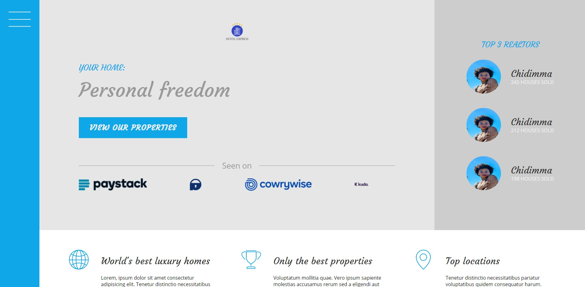

# Next Website
This is a practice website from the Advanced CSS and Sass Course



## Built With
- [HTML5](https://developer.mozilla.org/en-US/docs/Web/Guide/HTML/HTML5)
- [SASS](https://sass-lang.com/)
- [jQuery](https://jquery.com/)

## Requirements
 - NPM
 - Gulp.js

## Install
```
    $ git clone git@github.com:samiiexx/next.git main
    $ cd main
    $ npm install
    $ npm run build
```

## Running the project
Production directory is the `public` folder.\
\
Run a full build
```
gulp build
```
Watch files and run BrowserSync
```
gulp serve
```
### Individual Tasks
These tasks can be run individually.\
\
Include HTML partials
```
gulp html
```
Compile SASS, browser autoprefix and minify CSS
```
gulp style
```
Compile, transpile and minify JS
```
gulp js
```
Minify images
```
gulp image
```

## Contributors
- Favour Samuel (@samiiexx)

## License
Copyright (c) 2021 Favour Samuel.

For enquiries please contact us at [favour@starboxtech.com](mailto:favour@starboxtech.com).
